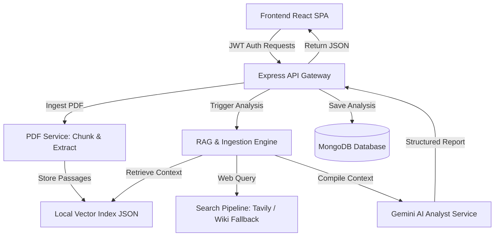

# InvestIQ - AI Investment Research Agent

InvestIQ is a production-quality, modular, and lightweight full-stack AI Investment Research Agent. It allows users to register, login, upload company annual/earnings reports (PDFs), parse the reports page-by-page, run local vector database queries (RAG), search the web for live market updates, and generate structured investment recommendation reports using Gemini 2.5 Flash.

---

## 1. Overview — What It Does

InvestIQ is designed to automate the heavy lifting of financial analysis for investment researchers. Key capabilities include:
* **Secure User Management**: User registration and login protected by salting/hashing passwords (bcryptjs) and issuing JSON Web Tokens (JWT).
* **PDF Report Ingestion**: Upload annual reports or earnings release files (PDFs). The server parses the document page-by-page, splits it into semantic chunks, and builds a local vector store.
* **Retrieval-Augmented Generation (RAG)**: When an analysis is run on a company, the system queries the local vector index for context relevant to the user query.
* **Live Web Intelligence & Multi-Tier Fallback**:
  * **Tier 1 (Tavily)**: Tries real-time web search for financial news, earnings updates, and stock metrics.
  * **Tier 2 (Wikipedia Search & Summary)**: If Tavily is unconfigured or returns an error, the agent automatically falls back to searching Wikipedia's database for the corporate overview.
  * **Tier 3 (Offline Sector Profiles)**: Fallback to offline sector intelligence if there is no internet access.
* **AI Analyst Assembly**: Aggregates the local document context and web news, formats a structured prompt, and queries Google Gemini to output a detailed analyst report highlighting key strengths, weaknesses, macro risks, and long-term viability.

---

## 2. How to Run It — Setup and Run Steps

### Prerequisites
* [Node.js](https://nodejs.org/) (v18 or higher recommended)
* [MongoDB](https://www.mongodb.com/try/download/community) (either running locally on port `27017` or a MongoDB Atlas connection string)

### 1. Backend Configuration
1. Navigate to the backend directory:
   ```bash
   cd backend
   ```
2. Install dependencies:
   ```bash
   npm install --legacy-peer-deps
   ```
3. Create a `.env` file in the `backend/` directory:
   ```env
   PORT=5000
   MONGO_URI=mongodb+srv://<username>:<password>@your-cluster.mongodb.net/investment-agent?retryWrites=true&w=majority
   JWT_SECRET=supersecretjwtkeyforinvestmentagent123
   GEMINI_API_KEY=your_gemini_api_key_here
   TAVILY_API_KEY=your_tavily_api_key_optional
   ```
4. Start the backend in development mode:
   ```bash
   npm run dev
   ```

> [!NOTE]
> **DNS querySrv Fallback**: If Node.js throws a `querySrv ECONNREFUSED` error (common on some Windows local DNS resolvers), the database connection helper will automatically catch the error, reconfigure Node to resolve via Google (`8.8.8.8`) and Cloudflare (`1.1.1.1`) DNS servers, and reconnect.

---

### 2. Frontend Configuration
1. Navigate to the frontend directory:
   ```bash
   cd frontend
   ```
2. Install dependencies:
   ```bash
   npm install
   ```
3. Create a `.env` file in the `frontend/` directory:
   ```env
   VITE_API_URL=http://localhost:5000/api
   ```
4. Start the Vite React development server:
   ```bash
   npm run dev
   ```
5. Open your browser and navigate to `http://localhost:5173/`.

> [!TIP]
> **Production API Normalizer**: The frontend dynamically normalizes the `VITE_API_URL`. If you forget to append `/api` to the end of the domain during deployment, the app will automatically correct the URL prefix before dispatching requests.

---

## 3. How It Works — Approach and Architecture



### Ingestion & Processing
* **PDF Parsing**: The file is loaded page-by-page using `pdf-parse` and split into smaller semantic text blocks (~1000 characters).
* **Local Document Database**: Chunks are processed and saved locally in a JSON-based vector format within the `backend/vector_store` directory.

### Context Generation & Search Fallbacks
* When an analysis is run, the engine fetches the top 5 most relevant semantic chunks from the local vector database using cosine similarity score ranking.
* Concurrently, a web search request is launched:
  1. **Tavily Search API** runs a targeted query on stock performance and valuation news.
  2. **Wikipedia Opensearch + Summary API**: If Tavily is unavailable or encounters a `401` error, the engine queries Wikipedia's search index to find the exact corporate page title (e.g. mapping "TESLA" to "Tesla, Inc.") and fetches its official page summary using a custom User-Agent header.

### Gemini Report Compilation
The compiled context is fed into a structured prompt using a custom system prompt:
```text
System: You are an expert financial analyst. Analyze the following local document excerpts and web news to compile a structured investment recommendation report.
```
Google Gemini processes the compiled dataset and returns a formatted markdown document.

---

## 4. Key Decisions & Trade-Offs

### Decisions & Strengths
* **React + Vite**: Chose Vite over CRA for near-instant hot module replacement (HMR) and highly optimized build sizes.
* **Modular MVC Structure**: The backend separation of controllers, services, models, and routes keeps code easy to maintain and test.
* **In-Process Document Database**: We built an in-process local JSON vector storage model to store and query PDF document chunks. This avoids the cost, setup complexity, and latency of commercial cloud vector databases for this assessment.
* **Robust DNS Fallback**: Configured dynamic DNS switching in the database connection layer to ensure local Windows configurations connect reliably.

### Trade-Offs & What was Left Out
* **Cloud File Storage**: Uploaded PDFs and JSON indices are stored locally in the server directories. In a production multi-server setup, these must be migrated to AWS S3/Google Cloud Storage to prevent data loss on server restarts.
* **Commercial Vector DB**: Kept vector calculations in-process. For huge volumes of PDFs, this should be migrated to MongoDB Atlas Vector Search or Pinecone.

---

## 5. Example Runs

### Example 1: Tesla, Inc. (TSLA)
* **Retrieved Web Summary (Wikipedia Fallback)**: *"Tesla, Inc. is an American multinational automotive and clean energy company... It designs, manufactures, and sells battery electric vehicles (BEVs), energy storage, and solar panels."*
* **AI Analysis Summary**:
  * **Strengths**: EV sector leadership, rapid growth in energy storage deployments (+125% YoY Megapacks).
  * **Weaknesses**: Downward pressure on auto average selling prices (ASPs) due to price wars in China.
  * **Risks**: High reliance on regulatory approvals for Full Self-Driving (FSD) and Cybercab robo-taxis.
  * **Verdict**: Neutral to Bullish depending on FSD scalability.

### Example 2: Apple Inc. (AAPL)
* **Retrieved Web Summary (Wikipedia Fallback)**: *"Apple Inc. is an American multinational technology company... known for consumer electronics, software, and online services."*
* **AI Analysis Summary**:
  * **Strengths**: Record-high services profit margins (~74% gross margin), massive 2.2B active device install base.
  * **Weaknesses**: Slowing hardware refresh cycles, decline in Chinese iPhone market share.
  * **Risks**: Regulatory antitrust pressures in the US and Europe.
  * **Verdict**: Strongly Bullish on services margin dominance and Apple Intelligence integration.

---

## 6. What We Would Improve with More Time

1. **Scalable Storage**: Store PDF uploads in a cloud bucket (AWS S3) and move vector stores to a dedicated managed vector search database (Pinecone).
2. **Workers for Parsing**: PDF parsing can be CPU-intensive. Moving chunking and vector storage to a separate background job worker (using BullMQ) would keep the main API thread responsive.
3. **Advanced RAG (Parent-Child Indexing)**: Store larger document chunks for Gemini's context window, but query smaller sub-chunks for vector matching, maximizing accuracy.
4. **Interactive Dashboard Charts**: Extract financial tables from PDFs and display them as interactive charts (using recharts).


